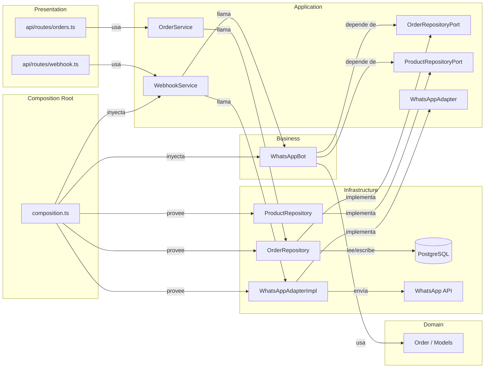

# Ports & Adapters en Shanti Food

> Arquitectura Hexagonal aplicada al proyecto Shanti Food.
> Explica por qué creamos `composition.ts`, los Repository Ports, y cómo el bot dejó de depender directamente de PostgreSQL.

---

## 1. ¿Qué es Ports & Adapters?

**Ports & Adapters** (también llamada *Arquitectura Hexagonal* o *Clean Architecture*) es un patrón que separa tu aplicación en capas y obliga a que las dependencias siempre apunten hacia el centro (el dominio), nunca hacia afuera (la infraestructura).

### Analogía: Restaurante

| Capa | Rol | Ejemplo en código |
|------|-----|-------------------|
| **Presentation** (`api/routes/`) | Mesero | Recibe pedidos del cliente (HTTP) |
| **Application** (`application/`) | Jefe de cocina | Coordina quién hace qué (Services) |
| **Business** (`bot/`) | Chef | Tiene la receta (lógica conversacional) |
| **Domain** (`domain/`) | Receta | Define qué es un pedido, qué reglas cumple |
| **Infrastructure** (`infrastructure/`) | Proveedor | Trae ingredientes (PostgreSQL, WhatsApp API) |

> **Regla de oro:** El chef **nunca** va al mercado. El encargado de compras (`composition.ts`) le trae los ingredientes.

---

## 2. ¿Qué problema teníamos antes?

Antes del refactor, el bot importaba directamente los repositorios de PostgreSQL:

```ts
// ❌ bot/WhatsAppBot.ts (ANTES)
import { orderRepository } from '../infrastructure/repositories/OrderRepository.js';
import { productRepository } from '../infrastructure/repositories/ProductRepository.js';

export class WhatsAppBot {
  async handleMessage(...) {
    const products = await productRepository.findByCategory('arroz_chino');
    // ...
    await orderRepository.save(order);
  }
}
```

### Problemas de esto:

1. **El bot sabe que usamos PostgreSQL.** Si mañana cambiamos a MongoDB, debemos tocar el bot.
2. **No se puede testear fácilmente.** El bot siempre intenta conectar a la base de datos real.
3. **Violación de capas.** `bot/` (negocio) depende de `infrastructure/` (PostgreSQL). Las flechas van para arriba, no para abajo.

---

## 3. La solución: Repository Ports

### 3.1 Definir el contrato (el Port)

Creamos una interfaz en `application/ports/` que dice **"todo repositorio de productos debe saber hacer esto"**:

```ts
// src/application/ports/ProductRepositoryPort.ts
export interface ProductRepositoryPort {
  findAll(includeUnavailable?: boolean): Promise<ProductRow[]>;
  findById(id: string): Promise<ProductRow | undefined>;
  findByCategory(categoryId: string, onlyAvailable?: boolean): Promise<ProductRow[]>;
  create(data: ProductInput): Promise<ProductRow>;
  update(id: string, data: Partial<ProductInput>): Promise<ProductRow>;
  delete(id: string): Promise<void>;
}
```

> El **Port** es solo una interfaz. No sabe de SQL, no sabe de MongoDB. Es un contrato.

### 3.2 Implementar el contrato (el Adapter)

El repositorio real dice "yo cumplo ese contrato":

```ts
// src/infrastructure/repositories/ProductRepository.ts
export class ProductRepository implements ProductRepositoryPort {
  async findAll(includeUnavailable = false): Promise<ProductRow[]> {
    const sql = includeUnavailable
      ? 'SELECT * FROM products ORDER BY category_id, name'
      : 'SELECT * FROM products WHERE available = true ORDER BY category_id, name';
    return query<ProductRow>(sql);
  }
  // ...
}
```

> El **Adapter** es la implementación concreta. Solo él sabe que usamos PostgreSQL.

### 3.3 El bot depende solo del contrato

```ts
// ✅ bot/WhatsAppBot.ts (DESPUÉS)
import type { ProductRepositoryPort } from '../application/ports/ProductRepositoryPort.js';
import type { OrderRepositoryPort } from '../application/ports/OrderRepositoryPort.js';

export class WhatsAppBot {
  constructor(
    private readonly orderRepo: OrderRepositoryPort,
    private readonly productRepo: ProductRepositoryPort
  ) {}

  async handleMessage(...) {
    const products = await this.productRepo.findByCategory('arroz_chino');
    // ...
    await this.orderRepo.save(order);
  }
}
```

> El bot **no sabe** de PostgreSQL. Solo sabe que existe algo que cumple el contrato `ProductRepositoryPort`.

---

## 4. Composition Root: ¿quién conecta todo?

El bot recibe los repositorios por constructor, pero ¿quién se los pasa?

### 4.1 `src/composition.ts` — La central eléctrica

```ts
// src/composition.ts
import { WhatsAppBot } from './bot/WhatsAppBot.js';
import { WebhookService } from './application/WebhookService.js';
import { orderRepository } from './infrastructure/repositories/OrderRepository.js';
import { productRepository } from './infrastructure/repositories/ProductRepository.js';
import { getAdapter } from './infrastructure/whatsapp/index.js';

export const bot = new WhatsAppBot(orderRepository, productRepository);
export const webhookService = new WebhookService(getAdapter(), bot);
```

### ¿Por qué es importante?

- Es el **único** archivo en toda la aplicación (fuera de Infrastructure) que importa desde `infrastructure/`.
- Es donde "componés" tu app: unís las piezas como un LEGO.
- Si mañana cambias PostgreSQL por MongoDB, **solo tocás este archivo**.

### Analogía

- `composition.ts` = el **encargado de compras** del restaurante.
- Es la **única persona** que habla con los proveedores.
- El chef le dice "necesito ingredientes" y el encargado se los trae.

---

## 5. ¿Cómo quedó la arquitectura?



### Regla visual

- **Las flechas solo apuntan hacia abajo o hacia Ports.**
- Nunca de `bot/` a `infrastructure/` directamente (salvo en `composition.ts`).
- Nunca de `api/` a `infrastructure/` directamente.

---

## 6. ¿Cómo se testea ahora?

### Antes (difícil)

```ts
// ❌ Antes: el bot siempre usaba PostgreSQL real
const bot = new WhatsAppBot(); // conecta a la BD
```

### Después (trivial)

```ts
// ✅ Ahora: pasás mocks que cumplen el contrato
const orderRepo = {
  save: vi.fn().mockResolvedValue(undefined),
  findById: vi.fn().mockResolvedValue(undefined),
  // ...todos los métodos del port
};

const productRepo = {
  findAll: vi.fn().mockResolvedValue(mockProducts),
  findById: vi.fn().mockResolvedValue(mockProduct),
  // ...todos los métodos del port
};

const bot = new WhatsAppBot(orderRepo, productRepo);
// El bot funciona igual, sin tocar PostgreSQL
```

> Como el bot solo depende de la **interfaz**, no le importa si le pasás el repo real o un mock. Ambos cumplen el contrato.

---

## 7. Comparación: Antes vs Después

| Aspecto | Antes | Después |
|---------|-------|---------|
| **Bot y PostgreSQL** | Acoplados (imports directos) | Desacoplados (via ports) |
| **Cambiar de BD** | Tocar todo el bot | Solo tocar `composition.ts` |
| **Tests** | Necesitás mockear módulos | Pasás mocks por constructor |
| **Capas** | Mezcladas | Limpias y separadas |
| **Imports desde `api/`** | `infrastructure/` directo | Solo vía `application/` |

---

## 8. Archivos clave del refactor

| Archivo | Rol |
|---------|-----|
| `src/application/ports/OrderRepositoryPort.ts` | Contrato para repos de órdenes |
| `src/application/ports/ProductRepositoryPort.ts` | Contrato para repos de productos |
| `src/infrastructure/repositories/OrderRepository.ts` | Implementación PostgreSQL del port |
| `src/infrastructure/repositories/ProductRepository.ts` | Implementación PostgreSQL del port |
| `src/composition.ts` | Wiring de dependencias (composition root) |
| `src/bot/WhatsAppBot.ts` | Solo depende de los ports |
| `src/application/OrderService.ts` | Medio entre API y repo |
| `src/application/WebhookService.ts` | Medio entre API y bot/adapter |

---

## 9. Conclusión

**Ports & Adapters** no es solo un patrón fancy — es una herramienta práctica que:

1. **Protege tu código de cambios externos.** Si WhatsApp cambia su API, solo tocas el adapter. Si cambias de PostgreSQL a MongoDB, solo tocas el repositorio.
2. **Hace los tests instantáneos.** Mocks por constructor, sin módulos, sin hacks.
3. **Obliga a pensar en capas.** Cada archivo sabe exactamente qué puede usar y qué no.

> La regla más simple: **si tu archivo importa de `infrastructure/`, probablemente debería estar en `composition.ts`.**
