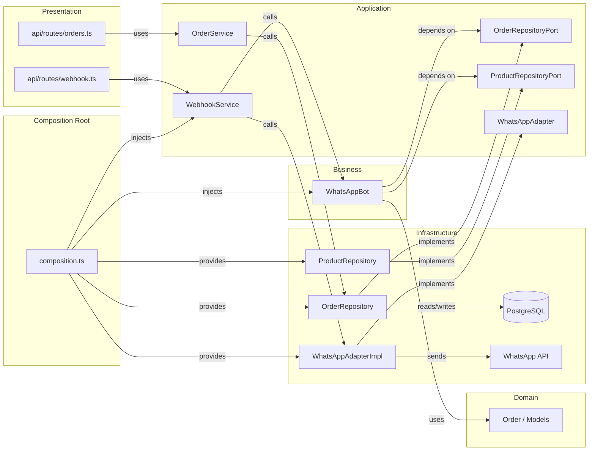

# Ports & Adapters in Shanti Food

> Hexagonal Architecture applied to the Shanti Food project.
> Explains why we created `composition.ts`, the Repository Ports, and how the bot stopped depending directly on PostgreSQL.

---

## 1. What is Ports & Adapters?

**Ports & Adapters** (also called *Hexagonal Architecture* or *Clean Architecture*) is a pattern that separates your application into layers and forces dependencies to always point toward the center (the domain), never outward (infrastructure).

### Analogy: Restaurant

| Layer | Role | Code example |
|------|------|-------------------|
| **Presentation** (`api/routes/`) | Waiter | Receives orders from the customer (HTTP) |
| **Application** (`application/`) | Head chef | Coordinates who does what (Services) |
| **Business** (`bot/`) | Chef | Has the recipe (conversation logic) |
| **Domain** (`domain/`) | Recipe | Defines what an order is, what rules it satisfies |
| **Infrastructure** (`infrastructure/`) | Supplier | Brings ingredients (PostgreSQL, WhatsApp API) |

> **Golden rule:** The chef **never** goes to the market. The purchasing manager (`composition.ts`) brings the ingredients.

---

## 2. What problem did we have before?

Before the refactor, the bot directly imported PostgreSQL repositories:

```ts
// ❌ bot/WhatsAppBot.ts (BEFORE)
import { orderRepository } from '../infrastructure/repositories/OrderRepository.js';
import { productRepository } from '../infrastructure/repositories/ProductRepository.js';

export class WhatsAppBot {
  async handleMessage(...) {
    const products = await productRepository.findByCategory('arroz_chino');
    // ...
    await orderRepository.save(order);
  }
}
```

### Problems with this:

1. **The bot knows we use PostgreSQL.** If tomorrow we switch to MongoDB, we must touch the bot.
2. **It cannot be easily tested.** The bot always tries to connect to the real database.
3. **Layer violation.** `bot/` (business) depends on `infrastructure/` (PostgreSQL). Arrows go upward, not downward.

---

## 3. The solution: Repository Ports

### 3.1 Define the contract (the Port)

We create an interface in `application/ports/` that says **"every product repository must know how to do this"**:

```ts
// src/application/ports/ProductRepositoryPort.ts
export interface ProductRepositoryPort {
  findAll(includeUnavailable?: boolean): Promise<ProductRow[]>;
  findById(id: string): Promise<ProductRow | undefined>;
  findByCategory(categoryId: string, onlyAvailable?: boolean): Promise<ProductRow[]>;
  create(data: ProductInput): Promise<ProductRow>;
  update(id: string, data: Partial<ProductInput>): Promise<ProductRow>;
  delete(id: string): Promise<void>;
}
```

> The **Port** is just an interface. It doesn't know SQL, it doesn't know MongoDB. It's a contract.

### 3.2 Implement the contract (the Adapter)

The real repository says "I fulfill that contract":

```ts
// src/infrastructure/repositories/ProductRepository.ts
export class ProductRepository implements ProductRepositoryPort {
  async findAll(includeUnavailable = false): Promise<ProductRow[]> {
    const sql = includeUnavailable
      ? 'SELECT * FROM products ORDER BY category_id, name'
      : 'SELECT * FROM products WHERE available = true ORDER BY category_id, name';
    return query<ProductRow>(sql);
  }
  // ...
}
```

> The **Adapter** is the concrete implementation. Only it knows we use PostgreSQL.

### 3.3 The bot depends only on the contract

```ts
// ✅ bot/WhatsAppBot.ts (AFTER)
import type { ProductRepositoryPort } from '../application/ports/ProductRepositoryPort.js';
import type { OrderRepositoryPort } from '../application/ports/OrderRepositoryPort.js';

export class WhatsAppBot {
  constructor(
    private readonly orderRepo: OrderRepositoryPort,
    private readonly productRepo: ProductRepositoryPort
  ) {}

  async handleMessage(...) {
    const products = await this.productRepo.findByCategory('arroz_chino');
    // ...
    await this.orderRepo.save(order);
  }
}
```

> The bot **doesn't know** about PostgreSQL. It only knows that something fulfills the `ProductRepositoryPort` contract.

---

## 4. Composition Root: who connects everything?

The bot receives repositories via constructor, but who passes them?

### 4.1 `src/composition.ts` — The power plant

```ts
// src/composition.ts
import { WhatsAppBot } from './bot/WhatsAppBot.js';
import { WebhookService } from './application/WebhookService.js';
import { orderRepository } from './infrastructure/repositories/OrderRepository.js';
import { productRepository } from './infrastructure/repositories/ProductRepository.js';
import { getAdapter } from './infrastructure/whatsapp/index.js';

export const bot = new WhatsAppBot(orderRepository, productRepository);
export const webhookService = new WebhookService(getAdapter(), bot);
```

### Why is it important?

- It's the **only** file in the entire application (outside Infrastructure) that imports from `infrastructure/`.
- It's where you "compose" your app: you put pieces together like LEGO.
- If tomorrow you switch PostgreSQL for MongoDB, **you only touch this file**.

### Analogy

- `composition.ts` = the restaurant's **purchasing manager**.
- It's the **only person** who talks to suppliers.
- The chef says "I need ingredients" and the manager brings them.

---

## 5. How does the architecture look now?



### Visual rule

- **Arrows only point downward or toward Ports.**
- Never from `bot/` to `infrastructure/` directly (except in `composition.ts`).
- Never from `api/` to `infrastructure/` directly.

---

## 6. How is testing done now?

### Before (hard)

```ts
// ❌ Before: the bot always used real PostgreSQL
const bot = new WhatsAppBot(); // connects to DB
```

### After (trivial)

```ts
// ✅ Now: you pass mocks that fulfill the contract
const orderRepo = {
  save: vi.fn().mockResolvedValue(undefined),
  findById: vi.fn().mockResolvedValue(undefined),
  // ...all methods from the port
};

const productRepo = {
  findAll: vi.fn().mockResolvedValue(mockProducts),
  findById: vi.fn().mockResolvedValue(mockProduct),
  // ...all methods from the port
};

const bot = new WhatsAppBot(orderRepo, productRepo);
// The bot works the same, without touching PostgreSQL
```

> Because the bot only depends on the **interface**, it doesn't care if you pass the real repo or a mock. Both fulfill the contract.

---

## 7. Comparison: Before vs After

| Aspect | Before | After |
|---------|-------|---------|
| **Bot and PostgreSQL** | Coupled (direct imports) | Decoupled (via ports) |
| **Change database** | Touch the whole bot | Only touch `composition.ts` |
| **Tests** | You need to mock modules | Pass mocks via constructor |
| **Layers** | Mixed | Clean and separated |
| **Imports from `api/`** | `infrastructure/` directly | Only via `application/` |

---

## 8. Key refactor files

| File | Role |
|---------|-----|
| `src/application/ports/OrderRepositoryPort.ts` | Contract for order repos |
| `src/application/ports/ProductRepositoryPort.ts` | Contract for product repos |
| `src/infrastructure/repositories/OrderRepository.ts` | PostgreSQL implementation of the port |
| `src/infrastructure/repositories/ProductRepository.ts` | PostgreSQL implementation of the port |
| `src/composition.ts` | Dependency wiring (composition root) |
| `src/bot/WhatsAppBot.ts` | Only depends on ports |
| `src/application/OrderService.ts` | Mediator between API and repo |
| `src/application/WebhookService.ts` | Mediator between API and bot/adapter |

---

## 9. Conclusion

**Ports & Adapters** is not just a fancy pattern — it's a practical tool that:

1. **Protects your code from external changes.** If WhatsApp changes its API, you only touch the adapter. If you switch from PostgreSQL to MongoDB, you only touch the repository.
2. **Makes tests instantaneous.** Mocks via constructor, no modules, no hacks.
3. **Forces you to think in layers.** Each file knows exactly what it can use and what it can't.

> The simplest rule: **if your file imports from `infrastructure/`, it should probably be in `composition.ts`.**
